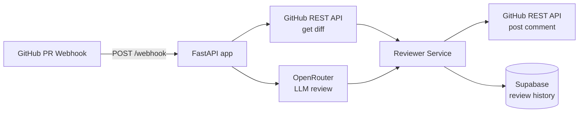

# pr-reviewer

pr-reviewer is a FastAPI service that listens for GitHub pull request events, fetches the PR diff, sends it to an LLM for structured review, and posts a formatted comment back to the PR. It is designed to run as a small webhook-backed service with minimal moving parts, while keeping review history ready for persistence in Supabase.

Live demo: <LINK_GOES_HERE>



## Setup

### Clone
```bash
git clone <YOUR_REPO_URL>
cd pr-reviewer
```

### Environment
Copy the example env file and fill in values.
```bash
cp .env.example .env
```

Required keys:
- GITHUB_TOKEN
- GITHUB_WEBHOOK_SECRET
- OPENROUTER_API_KEY
- OPENROUTER_MODEL
- SUPABASE_URL
- SUPABASE_SERVICE_ROLE_KEY

### Run locally
```bash
python -m venv .venv
source .venv/bin/activate
pip install -r requirements.txt
uvicorn app.main:app --host 0.0.0.0 --port 8000
```

### Expose locally with ngrok
```bash
ngrok http 8000
```
Use the HTTPS URL that ngrok provides as your GitHub webhook URL.

## Install on a GitHub repo

1. Go to the repo Settings → Webhooks → Add webhook.
2. Payload URL: `https://<your-public-host>/webhook`
3. Content type: `application/json`
4. Secret: set to `GITHUB_WEBHOOK_SECRET`
5. Select events: Pull requests
6. Save.

## Tech stack

| Layer | Tech |
| --- | --- |
| Runtime | Python 3.11+ |
| Web framework | FastAPI |
| HTTP client | httpx |
| Settings | pydantic-settings |
| LLM provider | OpenRouter |
| Persistence | Supabase |
| Tests | pytest, pytest-asyncio |


Testing
