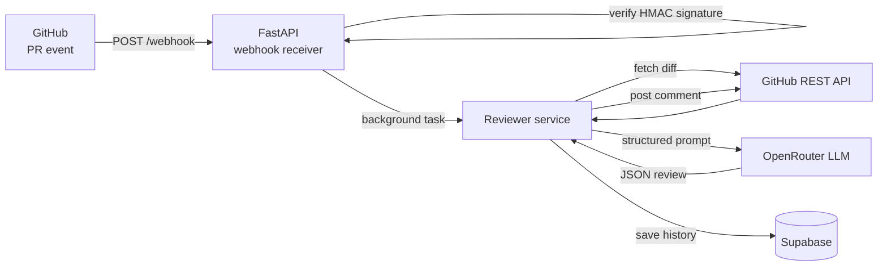

# pr-reviewer

A self-hosted GitHub bot that reviews pull requests automatically using an LLM. When a PR is opened or updated, pr-reviewer fetches the diff, sends it to an LLM for analysis, and posts a structured comment with a severity rating, identified risks, and concrete suggestions. Review history is persisted in Supabase.

**Live demo:** [link]

![Example PR comment showing severity rating, risks, and suggestions]

---

## How it works



Each review comment includes:
- **Severity** — `low`, `medium`, or `high` with a color indicator
- **Risks** — security and correctness issues found in the diff
- **Suggestions** — up to 5 concrete, actionable improvements
- **Summary** — one sentence describing what the PR does

---

## Setup

### Prerequisites

- Python 3.11+
- A GitHub account and a repo to install the bot on
- An [OpenRouter](https://openrouter.ai) account (free tier works)
- A [Supabase](https://supabase.com) project (free tier works)

### Clone

```bash
git clone <YOUR_REPO_URL>
cd pr-reviewer
python -m venv .venv
source .venv/bin/activate
pip install -r requirements.txt
```

### Environment

```bash
cp .env.example .env
```

| Variable | Description |
|---|---|
| `GITHUB_TOKEN` | Personal access token with `repo` scope |
| `GITHUB_WEBHOOK_SECRET` | Random secret — run `python -c "import secrets; print(secrets.token_hex(32))"` |
| `OPENROUTER_API_KEY` | From openrouter.ai/keys |
| `OPENROUTER_MODEL` | Default: `deepseek/deepseek-chat-v3-0324:free` |
| `SUPABASE_URL` | From your Supabase project settings |
| `SUPABASE_SERVICE_ROLE_KEY` | From your Supabase project settings → API |

### Supabase table

Run this in the Supabase SQL editor:

```sql
create table pr_reviews (
  id uuid primary key default gen_random_uuid(),
  repo_full_name text not null,
  pr_number integer not null,
  pr_title text,
  pr_url text not null,
  pr_sha text not null,
  author_login text,
  event_action text not null,
  severity text not null,
  summary text not null,
  risks jsonb,
  suggestions jsonb,
  llm_model text,
  diff_truncated boolean,
  created_at timestamptz default now()
);
```

### Run locally

```bash
uvicorn app.main:app --reload --port 8000
```

Verify it's running:

```bash
curl http://localhost:8000/health
```

---

## Install on a GitHub repo

**1. Expose your local server** (skip if deploying to Render)

```bash
ngrok http 8000
```

Copy the HTTPS forwarding URL — you'll use it as the webhook payload URL.

**2. Add the webhook**

Go to your repo → Settings → Webhooks → Add webhook:

| Field | Value |
|---|---|
| Payload URL | `https://<your-host>/webhook` |
| Content type | `application/json` |
| Secret | Value of `GITHUB_WEBHOOK_SECRET` in your `.env` |
| Events | Pull requests only |

**3. Test it**

Open a pull request on the repo. Within 10–20 seconds a review comment will appear.

---

## Deploy to Render

1. Create a new **Web Service** on [render.com](https://render.com)
2. Connect your GitHub repo
3. Set build command: `pip install -r requirements.txt`
4. Set start command: `uvicorn app.main:app --host 0.0.0.0 --port $PORT`
5. Add all environment variables from `.env` in the Render dashboard
6. Deploy — copy the Render URL and update your GitHub webhook payload URL

> **Note:** Render free tier spins down after 15 minutes of inactivity. GitHub retries failed webhook deliveries automatically, so no events are lost — but the first review after a cold start may take up to 60 seconds.

---

## API

| Method | Path | Description |
|---|---|---|
| `POST` | `/webhook` | GitHub webhook receiver |
| `GET` | `/health` | Service status and current model |
| `GET` | `/reviews/{owner}/{repo}` | Last 20 reviews for a repo |

---

## Tech stack

| Layer | Tech |
|---|---|
| Runtime | Python 3.11+ |
| Web framework | FastAPI |
| HTTP client | httpx (async) |
| Config | pydantic-settings |
| LLM provider | OpenRouter (DeepSeek free tier) |
| Persistence | Supabase (PostgreSQL) |
| Deployment | Render |
| Tests | pytest, pytest-asyncio |


Testing
